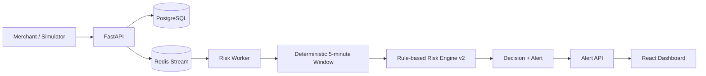

# Razorpay Risk Manager

## Fraud-Spike Detector

Razorpay Risk Manager is a portfolio-scale fraud-spike detection system for merchant transaction streams. It ingests payment events, groups them into deterministic five-minute merchant windows, evaluates rule-based risk signals, persists decisions, and exposes alerts through a React operations dashboard.

The project is designed to make sudden changes in transaction behavior visible: unusual volume, payment failures, baseline deviation, payment-method diversity, and unusually large transaction amounts.

## Features

- Merchant API-key authentication using `X-API-Key`
- Server-side merchant isolation across transactions, alerts, and dashboard queries
- FastAPI transaction ingestion
- Redis Streams event transport
- PostgreSQL persistence for merchants, transactions, windows, decisions, and alerts
- Deterministic five-minute aggregation
- Deterministic statistical/rule-based risk engine with merchant baselines and a low-sample alert guard
- Risk decision persistence and explanation text
- Fraud alert lifecycle: `open` -> `acknowledged` -> `resolved`
- React + Vite risk operations dashboard with auto-refresh
- Seeded transaction simulator with local ground-truth labels
- Evaluation harness for window-level TP/TN/FP/FN and classification metrics
- Bounded worker retries with a `transactions-dlq` Redis Stream after three failed attempts

## Architecture



The API stores the transaction in PostgreSQL and publishes a stream event. The worker reconstructs the complete merchant window from PostgreSQL, evaluates it, and upserts the corresponding window, decision, and alert records.

## Risk Engine

The detector is deliberately not presented as machine learning. It is a deterministic, explainable statistical/rule engine that scores each merchant window using:

- **Transaction volume:** when history exists, graduated points are based on the current volume reaching 1.25x, 1.5x, 2x, or 3x the merchant baseline; absolute volume bands are used only without a baseline.
- **Payment failure rate:** graduated points are based on the percentage-point increase over the merchant failure-rate baseline; absolute failure-rate bands are used only without a baseline.
- **Payment-method diversity:** two or more methods and four or more methods add diversity points.
- **Average transaction amount:** an average amount of at least INR 10,000 adds a large-amount signal.

Scores are capped at 100. Alerts also require enough absolute evidence: at least 10 transactions or at least 5 failed transactions. A volume-only 3x spike can therefore remain `watch`; combined volume and failure-rate deviations can cross the alert threshold. This preserves protection against a single noisy metric while allowing accumulated anomalies to receive stronger scores.

Scores are classified as:

- `alert`: score at least 70 and sufficient alert evidence
- `watch`: score at least 40 but below the alert condition
- `normal`: score below 40

Every alert stores the decision explanation, so the signals that caused it remain visible through the alert API and dashboard.

## Authentication and Security

Protected API requests send:

```http
X-API-Key: <merchant-api-key>
```

The backend hashes supplied keys with SHA-256 and persists only the hash in `merchants.api_key_hash`. Plaintext keys are not stored in PostgreSQL, ground-truth JSONL, or evaluation output. Merchant ownership is derived from the authenticated key and enforced in server-side queries; client-supplied merchant IDs cannot select another merchant's data.

Never commit a real API key. Local `.env` files are ignored by Git. The checked-in `.env.example` files contain placeholders only.

## Evaluation Methodology

The simulator writes transaction-level records with local ground-truth labels. The evaluator aggregates those labels by merchant and deterministic five-minute `window_start`, marking a window fraudulent if any generated transaction in that window is labeled fraudulent.

It compares those window labels with persisted risk decisions:

- `alert` is predicted fraud
- `normal` and `watch` are predicted non-fraud

It reports:

- True positives (`TP`)
- True negatives (`TN`)
- False positives (`FP`)
- False negatives (`FN`)
- Precision, recall, F1
- False-positive rate
- Unmatched windows
- Scenario-level and seed-level metrics for benchmark runs

Missing predictions are counted as non-fraud predictions for confusion-matrix
purposes, so a missing fraudulent window becomes a false negative. The
unmatched count remains visible instead of silently excluding that window.

## Benchmark Results

Measured live Docker Compose benchmark using a fresh merchant, fixed UTC
anchors, seeds `42`, `43`, and `44`, and all four scenarios. The benchmark sent
879 transactions and evaluated 150 windows with zero unmatched windows.

```text
Windows evaluated: 150
TP: 13
TN: 132
FP: 0
FN: 5

Precision: 1.0000
Recall: 0.7222
F1: 0.8387
False Positive Rate: 0.0000
Unmatched windows: 0
```

Scenario aggregates from the same run:

| Scenario | Windows | TP | TN | FP | FN | Precision | Recall | F1 | FPR |
| --- | ---: | ---: | ---: | ---: | ---: | ---: | ---: | ---: | ---: |
| normal | 30 | 0 | 30 | 0 | 0 | 0.0000 | 0.0000 | 0.0000 | 0.0000 |
| fraud_spike | 33 | 3 | 30 | 0 | 0 | 1.0000 | 1.0000 | 1.0000 | 0.0000 |
| gradual_fraud | 42 | 7 | 30 | 0 | 5 | 1.0000 | 0.5833 | 0.7368 | 0.0000 |
| recovery | 45 | 3 | 42 | 0 | 0 | 1.0000 | 1.0000 | 1.0000 | 0.0000 |

The scenario meanings are: `normal` is the negative control, `fraud_spike`
is abrupt high-volume/high-failure fraud, `gradual_fraud` introduces fraud in
stages, and `recovery` contains one fraud spike followed by normal traffic.

Run the benchmark with a newly provisioned merchant so the historical state is
isolated:

```powershell
python -m simulator.evaluation.benchmark `
	--merchant-id <merchant-id> `
	--api-key <merchant-api-key> `
	--seed 42 `
	--seed 43 `
	--seed 44 `
	--output $env:TEMP\risk-benchmark-ground-truth.jsonl `
	--json-output $env:TEMP\risk-benchmark-report.json
```

The benchmark uses fixed anchors and waits for all expected windows to be
persisted before evaluation. Ground-truth labels remain only in the JSONL
output and are removed from every transaction API payload.

These are measured benchmark results, not production guarantees. The main
remaining weakness is gradual-fraud recall: the low-sample alert guard and
staged signal buildup intentionally leave some early fraud windows as
`watch` rather than `alert`.

## Repository Structure

```text
backend/
	app/
		api/             FastAPI transaction, alert, and dashboard routes
		auth/            API-key authentication dependency
		aggregation/    Deterministic five-minute windowing
		db/              SQLAlchemy session setup
		models/          Merchant, transaction, window, decision, alert models
		risk/            Rule-based risk engine v2
		streaming/       Redis Stream worker
	scripts/           Merchant provisioning CLI
	tests/             Local pytest unit/API tests
database/migrations/ PostgreSQL schema and additive migrations
frontend/            React + Vite dashboard
simulator/
	scenarios/         Seeded transaction generator and ground truth output
	evaluation/        Ground-truth versus decision evaluator
docker-compose.yml   PostgreSQL, Redis, API, worker, and frontend services
```

## Prerequisites

- Docker Desktop with Docker Compose
- Python 3.12 or compatible Python version
- Node.js 20+ and npm for local frontend development
- A provisioned merchant API key for authenticated simulator and dashboard requests

## Local Setup

Start the complete stack:

```powershell
docker compose up -d --build
```

Services:

- API: `http://localhost:8000`
- Health check: `http://localhost:8000/health`
- Frontend: `http://localhost:5173`
- PostgreSQL: `localhost:5432`
- Redis: `localhost:6379`

Database migrations are mounted into PostgreSQL initialization. The additive API-key migration is `database/migrations/02_add_merchant_api_key_hash.sql`; `03_alerts_and_schema_cleanup.sql` adds the alert table, removes unused legacy tables, and renames the window recomputation timestamp. Existing Docker volumes need additive migrations applied once manually because PostgreSQL only runs init scripts for a new volume.

The application accepts generic PostgreSQL and Redis connection URLs through `DATABASE_URL` and `REDIS_URL`. Managed services such as Supabase PostgreSQL and Upstash Redis can be used through those variables; no provider-specific integration is required.

## Provision a Merchant

From the backend directory, create a merchant and receive its plaintext key once:

```powershell
cd backend
python scripts/provision_merchant.py `
	--name "Test Merchant" `
	--razorpay-account-id acc_test_001
```

The command prints the merchant ID and API key. Store the key securely; it is not recoverable from the database after creation.

## Configure API Keys

For the simulator:

```powershell
$env:SIMULATOR_API_KEY = "<your-merchant-api-key>"
```

For the Vite dashboard, create a local `frontend/.env.local` file:

```dotenv
VITE_API_BASE_URL=http://localhost:8000
VITE_API_KEY=<your-merchant-api-key>
```

For the Docker frontend service, set `VITE_API_KEY` in the shell before starting Compose:

```powershell
$env:VITE_API_KEY = "<your-merchant-api-key>"
docker compose up -d --build frontend
```

Do not put real keys in tracked files.

## Run the Simulator

The simulator uses seeded randomness, backdated timestamps, and naturally aligned five-minute windows. It supports `normal`, `fraud_spike`, `gradual_fraud`, and `recovery`.

Send a fraud-spike scenario:

```powershell
python simulator/scenarios/generator.py `
	--scenario fraud_spike `
	--seed 42 `
	--output $env:TEMP\risk-ground-truth.jsonl
```

Use `--dry-run` to generate JSONL without calling the API. Repeat `--merchant-id` to target multiple existing merchants. API payloads retain the merchant ID for compatibility, but ownership is enforced by the API key.

## Run Evaluation

The evaluator requires the same merchant API key to query the dashboard timeline:

```powershell
python simulator/evaluation/evaluate.py `
	--ground-truth $env:TEMP\risk-ground-truth.jsonl `
	--json-output $env:TEMP\risk-evaluation.json
```

Set `SIMULATOR_API_KEY` before running it. The evaluator fails clearly if the key is missing or reports unmatched windows instead of silently scoring incomplete data.

## Run Backend Tests

```powershell
cd backend
python -m pip install -r requirements.txt
python -m pytest -q
```

This runs the backend unit and API tests, including the focused worker retry/DLQ test in `backend/tests/test_worker.py`.

Run the evaluator tests separately from the repository root:

```powershell
python -m pytest -q simulator/evaluation/test_evaluate.py
```

The benchmark runner is separate from the test suite. It sends deterministic scenarios through a running stack and reports aggregate, scenario-level, and seed-level metrics:

```powershell
python -m simulator.evaluation.benchmark `
	--merchant-id <merchant-id> `
	--api-key <merchant-api-key> `
	--seed 42 `
	--seed 43 `
	--seed 44
```

The test suite uses isolated unit fixtures and FastAPI `TestClient`; it does not require manually running PostgreSQL or Redis.

## API Overview

All routes below require `X-API-Key` unless noted otherwise.

| Method | Endpoint | Purpose |
| --- | --- | --- |
| `GET` | `/health` | Dependency health check for PostgreSQL and Redis |
| `POST` | `/api/v1/transactions` | Ingest a transaction and publish it to Redis Streams |
| `GET` | `/api/v1/dashboard/summary` | Authenticated merchant summary |
| `GET` | `/api/v1/dashboard/timeline` | Authenticated merchant risk windows |
| `GET` | `/api/v1/dashboard/merchants/me` | Authenticated merchant details and recent alerts |
| `GET` | `/api/v1/dashboard/merchants/{merchant_id}` | Legacy-compatible merchant details route, restricted to the authenticated merchant |
| `GET` | `/api/v1/alerts` | Authenticated merchant alert list with filters and pagination |
| `GET` | `/api/v1/alerts/{alert_id}` | Retrieve an owned alert |
| `PATCH` | `/api/v1/alerts/{alert_id}/acknowledge` | Acknowledge an owned open alert |
| `PATCH` | `/api/v1/alerts/{alert_id}/resolve` | Resolve an owned acknowledged alert |

## Alert Lifecycle

When a risk decision is classified as `alert`, the worker creates an open alert:

```text
open --acknowledge--> acknowledged --resolve--> resolved
```

The dashboard exposes the current status and calls the acknowledge/resolve endpoints. Resolved alerts remain available in alert history but are no longer active alerts.

## Limitations and Current Status

- The system is a focused fraud-spike detector, not a general fraud decisioning platform.
- The risk engine is deterministic and rule/statistical based; it is not an ML model.
- Gradual fraud can produce false negatives while signals accumulate.
- The current deployment is a Docker Compose development/demo stack, not a production deployment.
- Broader multi-seed and multi-scenario benchmarking remains future work; the checked-in result above is one reproducible live run.
- Stronger key rotation, distributed rate limiting, richer audit workflows, and high-availability data services remain production improvements.
- The dashboard currently monitors the authenticated merchant configured for its API key.

## Future Scaling Direction

A production-scale direction would be:

```text
Load balancer
	-> horizontally scaled FastAPI instances
	-> Redis Streams
	-> horizontally scaled risk workers
	-> PostgreSQL and Redis
```

The current project does not claim production readiness or validation at 1M requests/sec. Those targets would require load testing, capacity planning, operational observability, high-availability data services, stronger key management, and deployment-specific reliability work.

## Technologies

- Python 3.12
- FastAPI and Uvicorn
- Pydantic
- SQLAlchemy
- PostgreSQL 15
- Redis 7 Streams
- React 19
- Vite
- Recharts
- Docker Compose
- pytest